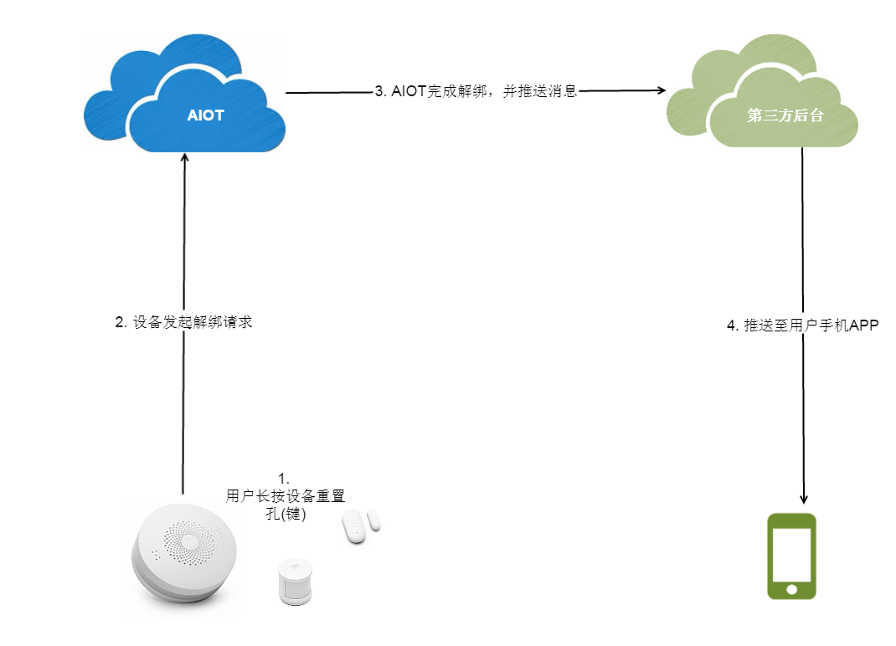

# 设备解绑

用户也可以解绑设备，解绑的方式对于网关类设备和子设备没什么差别，但都具有两种方式：

- 由手机APP发起设备解绑
- 设备自身触发解绑（长按重置键）

---

##手机APP发起设备解绑

手机APP发起设备解绑的流程如下：

1. 用户在手机APP上操作设备解绑
2. 解绑命令由AIOT发送至网关
3. 网关收到解绑消息，如果是子设备解绑就将子设备的信息删除，如果是网关解绑，就将网关保存的用户id删除掉，并同时开启可入网模式

| API | 描述 | payload | header | response |
| -- | -- | -- | -- | -- |
| /open/device/unbind/gateway | 网关类设备解绑 | {"openId":"xxx","**did**":"xxx"} | {"**Appid**":"xxx","**Appkey**":"xxx","Openid":"xxx","**Access-Token**":"xxx"} | {"code":0(errorcode), "result":"msg"}} |
| /open/device/unbind/subdevice | 子设备解绑 | {"openId":"xxx","**did**":"xxx"} | {"**Appid**":"xxx","**Appkey**":"xxx","Openid":"xxx","**Access-Token**":"xxx"} | {"code":0(errorcode), "result":"msg"}} |

---

##设备发起解绑

用户可以长按设备的重置孔进行解绑，这种方式的解绑流程如下：

- 用户长按设备的重置孔
- 设备向AIOT发起解绑的请求
- AIOT完成设备与用户的解绑，并将消息推送至第三方应用后台
- 第三方应用后台将消息推送至用户手机APP

需要第三方应用后台提供接收消息的接口，这里定义消息内容格式：

| payload | header | 描述 |
| -- | -- | -- |
| {"did":"xxx","result":0/1} | {"Appid":"xxx","Appkey":"xxx"} | 解绑消息推送 |

> - did: 设备id
> - result: 解绑结果,0-失败,1-成功
> - Appid: 第三方应用的appId
> - Appkey: 第三方应用的appKey